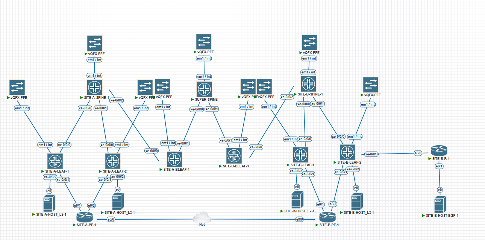

# Построение сети ЦОД для связности двух сайтов по L2 и L3.

В данной работе рассмотрим обеспечение связности между двумя сайтами с использованием VXLAN EVPN, и используя технологии которые мы рассматривали в лабах, такие как ESI multihomming, l2vni, l3vni.

Для упрощения схемы мы не будем дублировать некоторые устройства, такие как SPINE или PE.

Фабрика строится на Juniper vQFX

---
## Схема:

На каждом сайте будут по 2 лифа, к которым будут подключены роутеры для выхода во вне, а также хосты. По одному хосту на каждом сайте мы вынесем в обзий L2 домен, для проверки L2 связности, и по одному хосту оставим каждый в своем влане, для проверки L3 связности. Маршрутизаторы будут подключаться с помощью агрегата. Так же на каждом сайте будет по одному бордер лифу, для подключения к суперспайну и обеспечения связности между сайтами.

## Адресация:

В качестве сетей для распределения выбраны сети:\
P2P FABRIC- 10.100.0.0/24\
Loopback - 10.200.0.0/24\
P2P WAN- 100.64.0.0/24\
CLIENT_1 - 100.64.10.0/24\
CLIENT_2 - 100.64.20.0/24\
CLIENT_3 - 100.64.30.0/24 

### Распределение адресации:
