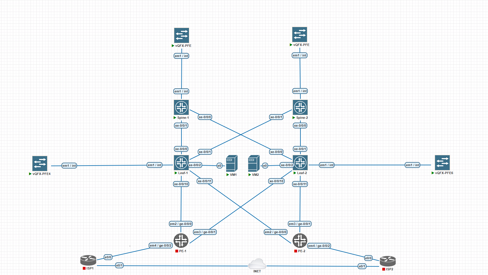

## Распределение адресного пространства

### Схема:

Лабораторная работа строится на Juniper QFX, поэтому на схеме присутствуют линейные карты PFE.
Так же на схеме присутствуют PE маршрутизаторы и эмуляции подключения к интернету через ISP, на данном этапе на них можно не обращать внимание.

### Таблица для P2P-линков (10.100.0.0/24)

| Устройство 1 | Интерфейс | Устройство 2 | Интерфейс | IP-адрес устройства 1 | IP-адрес устройства 2 | Подсеть         |
|--------------|-----------|--------------|-----------|-----------------------|-----------------------|-----------------|
| Spine 1      | xe-0/0/0      | Leaf 1       | xe-0/0/0      | 10.100.0.1/31         | 10.100.0.2/31         | 10.100.0.0/31   |
| Spine 1      | xe-0/0/1      | Leaf 2       | xe-0/0/0      | 10.100.0.3/31         | 10.100.0.4/31         | 10.100.0.2/31   |
| Spine 2      | xe-0/0/0      | Leaf 1       | xe-0/0/1      | 10.100.0.5/31         | 10.100.0.6/31         | 10.100.0.4/31   |
| Spine 2      | xe-0/0/1      | Leaf 2       | xe-0/0/1      | 10.100.0.7/31         | 10.100.0.8/31         | 10.100.0.6/31   |

---

### Таблица для Loopback-интерфейсов (10.200.0.0/24)

| Устройство   | Интерфейс | IP-адрес       | Подсеть         |
|--------------|-----------|----------------|-----------------|
| Spine 1      | Loopback0 | 10.200.0.1/32  | 10.200.0.0/24   |
| Spine 2      | Loopback0 | 10.200.0.2/32  | 10.200.0.0/24   |
| Leaf 1       | Loopback0 | 10.200.0.3/32  | 10.200.0.0/24   |
| Leaf 2       | Loopback0 | 10.200.0.4/32  | 10.200.0.0/24   |
