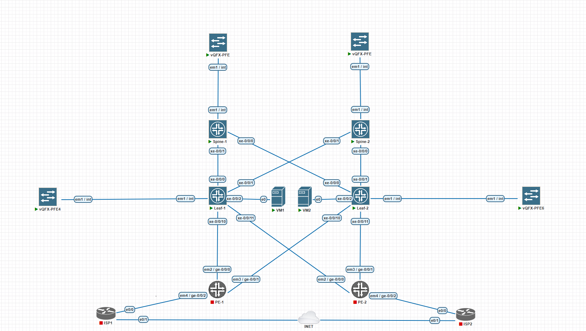

# VxLAN. EVPN L3
---

Будут использованы следующие vlan и сети:
|VLAN|УСТРОЙСТВО|АДРЕС|
|---|---|---|
|100|LEAF-1|10.10.10.1|
|100|VM-1|10.10.10.200|
|200|LEAF-2|10.10.20.1|
|200|VM-2|10.10.20.200|

## Схема


## Конфигурация L3VNI
Leaf-1:
```
routing-instances {
    WAN {
        instance-type vrf;
        interface irb.100;
        route-distinguisher 10.200.0.3:100;
        vrf-target target:65001:1;
        vrf-table-label;
        routing-options {
            multipath {
                vpn-unequal-cost equal-external-internal;
            }
        }
        protocols {
            evpn {
                ip-prefix-routes {
                    advertise direct-nexthop;
                    encapsulation vxlan;
                    vni 65001;
                }
            }
        }                               
    }
}
```
Можно использовать instance-type evpn если нужны bridge-domains.
Назначаем rd, vni, включаем мультипас. vrf-table-label - назначает mpls метку чтобы маршруты попадали в нужную таблицу и балансировка работала корректно.
А также сразу включим irb.100 в vrf, на leaf-2 будет irb.200.

Настроим l3 интерфейс и привяжем его к vlan:
```
interfaces { 
    irb {
        unit 100 {
            family inet {
                address 10.10.10.1/24;
            }
            mac 00:00:5e:00:53:01;
        }
    }
}
vlans {
    v100 {
        l3-interface irb.100;
}                    
```
Задаем мак чтобы в дальнейшем можно было использовать anycast gateway.
На Leaf-2 соответственно будет использоваться сеть 10.10.20.0/24 и vlan 200.

Проверяем связность между ВМ:
```
gns3@box:~$ ip a
1: lo: <LOOPBACK,UP,LOWER_UP> mtu 65536 qdisc noqueue state UNKNOWN 
    link/loopback 00:00:00:00:00:00 brd 00:00:00:00:00:00
    inet 127.0.0.1/8 scope host lo
       valid_lft forever preferred_lft forever
    inet6 ::1/128 scope host 
       valid_lft forever preferred_lft forever
2: dummy0: <BROADCAST,NOARP> mtu 1500 qdisc noop state DOWN 
    link/ether ba:f5:33:fd:1c:ee brd ff:ff:ff:ff:ff:ff
3: tunl0@NONE: <NOARP> mtu 1480 qdisc noop state DOWN 
    link/ipip 0.0.0.0 brd 0.0.0.0
4: ip_vti0@NONE: <NOARP> mtu 1364 qdisc noop state DOWN 
    link/ipip 0.0.0.0 brd 0.0.0.0
5: eth0: <BROADCAST,MULTICAST,UP,LOWER_UP> mtu 1500 qdisc pfifo_fast state UP qlen 1000
    link/ether 50:c0:14:00:09:00 brd ff:ff:ff:ff:ff:ff
    inet 10.10.10.200/24 brd 10.10.10.255 scope global eth0
       valid_lft forever preferred_lft forever
    inet6 fe80::52c0:14ff:fe00:900/64 scope link 
       valid_lft forever preferred_lft forever
gns3@box:~$ ping 10.10.20.200
PING 10.10.20.200 (10.10.20.200): 56 data bytes
64 bytes from 10.10.20.200: seq=0 ttl=63 time=423.816 ms
64 bytes from 10.10.20.200: seq=1 ttl=63 time=350.039 ms
64 bytes from 10.10.20.200: seq=2 ttl=63 time=372.445 ms
64 bytes from 10.10.20.200: seq=3 ttl=63 time=275.377 ms
64 bytes from 10.10.20.200: seq=4 ttl=63 time=386.182 ms
^C
--- 10.10.20.200 ping statistics ---
5 packets transmitted, 5 packets received, 0% packet loss
round-trip min/avg/max = 275.377/361.571/423.816 ms
```
Связность есть, посмотрим маршруты на коммутаторе, заглянем в таблицы WAN и default-switch:
```
WAN.evpn.0: 2 destinations, 3 routes (2 active, 0 holddown, 0 hidden)
+ = Active Route, - = Last Active, * = Both

5:10.200.0.3:100::0::10.10.10.0::24/248               
                   *[EVPN/170] 00:12:20
                      Indirect
5:10.200.0.4:100::0::10.10.20.0::24/248               
                   *[BGP/170] 00:11:44, localpref 100, from 10.200.0.1
                      AS path: I, validation-state: unverified
                      to 10.100.0.0 via xe-0/0/0.0
                    > to 10.100.0.4 via xe-0/0/1.0
                    [BGP/170] 00:11:27, localpref 100, from 10.200.0.2
                      AS path: I, validation-state: unverified
                      to 10.100.0.0 via xe-0/0/0.0
                    > to 10.100.0.4 via xe-0/0/1.0

default-switch.evpn.0: 6 destinations, 6 routes (6 active, 0 holddown, 0 hidden)
+ = Active Route, - = Last Active, * = Both

2:10.200.0.3:1::100::00:00:5e:00:53:01/304 MAC/IP        
                   *[EVPN/170] 00:14:46
                      Indirect
2:10.200.0.3:1::100::50:9d:51:00:09:00/304 MAC/IP        
                   *[EVPN/170] 00:12:00
                      Indirect
2:10.200.0.3:1::100::50:c0:14:00:09:00/304 MAC/IP        
                   *[EVPN/170] 00:01:21
                      Indirect
2:10.200.0.3:1::100::00:00:5e:00:53:01::10.10.10.1/304 MAC/IP        
                   *[EVPN/170] 00:14:46
                      Indirect
2:10.200.0.3:1::100::50:c0:14:00:09:00::10.10.10.200/304 MAC/IP        
                   *[EVPN/170] 00:00:46
                      Indirect
3:10.200.0.3:1::100::10.200.0.3/248 IM            
                   *[EVPN/170] 00:12:19
                      Indirect
```

Мы видим type 5 маршруты для локальной и удаленной сети, что говорит нам о том что используется симметричная модель irb.\
Также теперь мы видим ip в маршрутах 2ого типа, потому что теперь у нас создан irb и arp suppression включен.\
Заглянем в evpn:
```
root@LEAF-1> show evpn database 
Instance: default-switch
VLAN  DomainId  MAC address        Active source                  Timestamp        IP address
     100        00:00:5e:00:53:01  irb.100                        Apr 15 20:40:00  10.10.10.1
     100        50:c0:14:00:09:00  xe-0/0/2.0                     Apr 15 20:51:32  10.10.10.200
```
Теперь мы видим адреса из arp запросов.
Связность есть, все работает.

### Альтернативный вариант
Уберем экспорт маршрутов 5ого типа, и создадим оба vni на обоих лифах, чтобы проверить досточно ли будет маршрутов 2ого типа для связности./
Конфиг на обоих лифах:
```
vlans {
    default {
        vlan-id 1;
    }
    v100 {
        description L3TEST;
        vlan-id 100;
        l3-interface irb.100;
        vxlan {
            vni 100;
        }
    }                                   
    v200 {
        description L3TEST;
        vlan-id 200;
        l3-interface irb.200;
        vxlan {
            vni 200;
        }
    }
}
interfaces { 
    irb {
        unit 100 {
            family inet {
                address 10.10.10.1/24;
            }
            mac 00:00:5e:00:53:01;
        }
        unit 200 {
            family inet {
                address 10.10.20.1/24;  
            }
            mac 00:00:5e:00:53:01;
        }
    }
}
routing-instances {
    WAN {
        instance-type vrf;
        interface irb.100;
        interface irb.200;
        route-distinguisher 10.200.0.3:100;
        vrf-target target:65001:1;
        vrf-table-label;
        routing-options {
            multipath {
                vpn-unequal-cost equal-external-internal;
            }
        }
        protocols {
            evpn;                       
        }
    }
}
```
Так же удалим экспорт маршрутов 5ого типа - delete routing-instances WAN protocols evpn ip-prefix-routes/
ВМ остаются каждая в своей сети.

Проверим маршруты на 1ом лифе:
```
default-switch.evpn.0: 17 destinations, 25 routes (17 active, 0 holddown, 0 hidden)
+ = Active Route, - = Last Active, * = Both

2:10.200.0.3:1::100::00:00:5e:00:53:01/304 MAC/IP        
                   *[EVPN/170] 00:17:05
                      Indirect
2:10.200.0.3:1::100::50:9d:51:00:09:00/304 MAC/IP        
                   *[EVPN/170] 11:56:43
                      Indirect
2:10.200.0.3:1::100::50:c0:14:00:09:00/304 MAC/IP        
                   *[EVPN/170] 11:46:04
                      Indirect
2:10.200.0.3:1::200::00:00:5e:00:53:01/304 MAC/IP        
                   *[EVPN/170] 00:07:58 
                      Indirect
2:10.200.0.4:1::100::00:00:5e:00:53:01/304 MAC/IP        
                   *[BGP/170] 00:16:59, localpref 100, from 10.200.0.1
                      AS path: I, validation-state: unverified
                      to 10.100.0.0 via xe-0/0/0.0
                    > to 10.100.0.4 via xe-0/0/1.0
                    [BGP/170] 00:16:59, localpref 100, from 10.200.0.2
                      AS path: I, validation-state: unverified
                      to 10.100.0.0 via xe-0/0/0.0
                    > to 10.100.0.4 via xe-0/0/1.0
2:10.200.0.4:1::200::00:00:5e:00:53:01/304 MAC/IP        
                   *[BGP/170] 00:16:59, localpref 100, from 10.200.0.1
                      AS path: I, validation-state: unverified
                    > to 10.100.0.0 via xe-0/0/0.0
                      to 10.100.0.4 via xe-0/0/1.0
                    [BGP/170] 00:16:59, localpref 100, from 10.200.0.2
                      AS path: I, validation-state: unverified
                    > to 10.100.0.0 via xe-0/0/0.0
                      to 10.100.0.4 via xe-0/0/1.0
2:10.200.0.4:1::200::50:32:93:00:08:00/304 MAC/IP        
                   *[BGP/170] 00:25:58, localpref 100, from 10.200.0.1
                      AS path: I, validation-state: unverified
                    > to 10.100.0.0 via xe-0/0/0.0
                      to 10.100.0.4 via xe-0/0/1.0
                    [BGP/170] 00:25:58, localpref 100, from 10.200.0.2
                      AS path: I, validation-state: unverified
                    > to 10.100.0.0 via xe-0/0/0.0
                      to 10.100.0.4 via xe-0/0/1.0
2:10.200.0.3:1::100::00:00:5e:00:53:01::10.10.10.1/304 MAC/IP        
                   *[EVPN/170] 00:17:05
                      Indirect
2:10.200.0.3:1::100::50:c0:14:00:09:00::10.10.10.200/304 MAC/IP        
                   *[EVPN/170] 00:15:56
                      Indirect
2:10.200.0.3:1::200::00:00:5e:00:53:01::10.10.20.1/304 MAC/IP        
                   *[EVPN/170] 00:07:58
                      Indirect
2:10.200.0.4:1::100::00:00:5e:00:53:01::10.10.10.1/304 MAC/IP        
                   *[BGP/170] 00:07:49, localpref 100, from 10.200.0.1
                      AS path: I, validation-state: unverified
                    > to 10.100.0.0 via xe-0/0/0.0
                      to 10.100.0.4 via xe-0/0/1.0
                    [BGP/170] 00:07:48, localpref 100, from 10.200.0.2
                      AS path: I, validation-state: unverified
                    > to 10.100.0.0 via xe-0/0/0.0
                      to 10.100.0.4 via xe-0/0/1.0
2:10.200.0.4:1::200::00:00:5e:00:53:01::10.10.20.1/304 MAC/IP        
                   *[BGP/170] 00:16:59, localpref 100, from 10.200.0.1
                      AS path: I, validation-state: unverified
                    > to 10.100.0.0 via xe-0/0/0.0
                      to 10.100.0.4 via xe-0/0/1.0
                    [BGP/170] 00:16:59, localpref 100, from 10.200.0.2
                      AS path: I, validation-state: unverified
                    > to 10.100.0.0 via xe-0/0/0.0
                      to 10.100.0.4 via xe-0/0/1.0
2:10.200.0.4:1::200::50:32:93:00:08:00::10.10.20.200/304 MAC/IP        
                   *[BGP/170] 00:16:19, localpref 100, from 10.200.0.1
                      AS path: I, validation-state: unverified
                      to 10.100.0.0 via xe-0/0/0.0
                    > to 10.100.0.4 via xe-0/0/1.0
                    [BGP/170] 00:16:18, localpref 100, from 10.200.0.2
                      AS path: I, validation-state: unverified
                      to 10.100.0.0 via xe-0/0/0.0
                    > to 10.100.0.4 via xe-0/0/1.0
3:10.200.0.3:1::100::10.200.0.3/248 IM            
                   *[EVPN/170] 11:57:02
                      Indirect
3:10.200.0.3:1::200::10.200.0.3/248 IM            
                   *[EVPN/170] 00:25:57 
                      Indirect
3:10.200.0.4:1::100::10.200.0.4/248 IM            
                   *[BGP/170] 00:26:21, localpref 100, from 10.200.0.1
                      AS path: I, validation-state: unverified
                    > to 10.100.0.0 via xe-0/0/0.0
                      to 10.100.0.4 via xe-0/0/1.0
                    [BGP/170] 00:26:21, localpref 100, from 10.200.0.2
                      AS path: I, validation-state: unverified
                    > to 10.100.0.0 via xe-0/0/0.0
                      to 10.100.0.4 via xe-0/0/1.0
3:10.200.0.4:1::200::10.200.0.4/248 IM            
                   *[BGP/170] 00:25:58, localpref 100, from 10.200.0.1
                      AS path: I, validation-state: unverified
                      to 10.100.0.0 via xe-0/0/0.0
                    > to 10.100.0.4 via xe-0/0/1.0
                    [BGP/170] 00:25:58, localpref 100, from 10.200.0.2
                      AS path: I, validation-state: unverified
                      to 10.100.0.0 via xe-0/0/0.0
                    > to 10.100.0.4 via xe-0/0/1.0

{master:0}
```

Теперь мы видим маршруты 2ого типа для каждой ВМ, проверим связность:
```
gns3@box:~$ ip a
1: lo: <LOOPBACK,UP,LOWER_UP> mtu 65536 qdisc noqueue state UNKNOWN 
    link/loopback 00:00:00:00:00:00 brd 00:00:00:00:00:00
    inet 127.0.0.1/8 scope host lo
       valid_lft forever preferred_lft forever
    inet6 ::1/128 scope host 
       valid_lft forever preferred_lft forever
2: dummy0: <BROADCAST,NOARP> mtu 1500 qdisc noop state DOWN 
    link/ether 22:24:1c:db:60:78 brd ff:ff:ff:ff:ff:ff
3: tunl0@NONE: <NOARP> mtu 1480 qdisc noop state DOWN 
    link/ipip 0.0.0.0 brd 0.0.0.0
4: ip_vti0@NONE: <NOARP> mtu 1364 qdisc noop state DOWN 
    link/ipip 0.0.0.0 brd 0.0.0.0
5: eth0: <BROADCAST,MULTICAST,UP,LOWER_UP> mtu 1500 qdisc pfifo_fast state UP qlen 1000
    link/ether 50:32:93:00:08:00 brd ff:ff:ff:ff:ff:ff
    inet 10.10.20.200/24 brd 10.10.20.255 scope global eth0
       valid_lft forever preferred_lft forever
    inet6 fe80::5232:93ff:fe00:800/64 scope link 
       valid_lft forever preferred_lft forever
gns3@box:~$ ping 10.10.10.200
PING 10.10.10.200 (10.10.10.200): 56 data bytes
64 bytes from 10.10.10.200: seq=0 ttl=63 time=257.756 ms
64 bytes from 10.10.10.200: seq=1 ttl=63 time=288.300 ms
64 bytes from 10.10.10.200: seq=2 ttl=63 time=239.407 ms
^C
--- 10.10.10.200 ping statistics ---
4 packets transmitted, 3 packets received, 25% packet loss
round-trip min/avg/max = 239.407/261.821/288.300 ms
```

Заглянем в таблицы evpn и mac:
```
root@LEAF-1> show ethernet-switching table vlan-id 200 

MAC flags (S - static MAC, D - dynamic MAC, L - locally learned, P - Persistent static
           SE - statistics enabled, NM - non configured MAC, R - remote PE MAC, O - ovsdb MAC)


Ethernet switching table : 1 entries, 1 learned
Routing instance : default-switch
   Vlan                MAC                 MAC      Logical                Active
   name                address             flags    interface              source
   v200                50:32:93:00:08:00   D        vtep.32769             10.200.0.4                    

{master:0}
root@LEAF-1> show ethernet-switching table vlan-id 100    

MAC flags (S - static MAC, D - dynamic MAC, L - locally learned, P - Persistent static
           SE - statistics enabled, NM - non configured MAC, R - remote PE MAC, O - ovsdb MAC)


Ethernet switching table : 2 entries, 2 learned
Routing instance : default-switch
   Vlan                MAC                 MAC      Logical                Active
   name                address             flags    interface              source
   v100                50:9d:51:00:09:00   D        xe-0/0/2.0           
   v100                50:c0:14:00:09:00   D        xe-0/0/2.0           

{master:0}
root@LEAF-1> show evpn database 
Instance: default-switch
VLAN  DomainId  MAC address        Active source                  Timestamp        IP address
     100        00:00:5e:00:53:01  irb.100                        Apr 16 08:36:34  10.10.10.1
     100        50:c0:14:00:09:00  xe-0/0/2.0                     Apr 16 08:36:33  10.10.10.200
     200        00:00:5e:00:53:01  irb.200                        Apr 16 08:36:34  10.10.20.1
     200        50:32:93:00:08:00  10.200.0.4                     Apr 16 08:20:44  10.10.20.200

{master:0}
```

Связность есть, все адреса мы видим, можно использовать таккой подход для обеспечения связности, но без 5ого типа маршрутов, сети не получится экспортировать наружу, что не позволит обеспечить связность с внешним миром.

Файлы конфигурации(с использованием type 5 маршрутов):
- [LEAF-1](LEAF-1)
