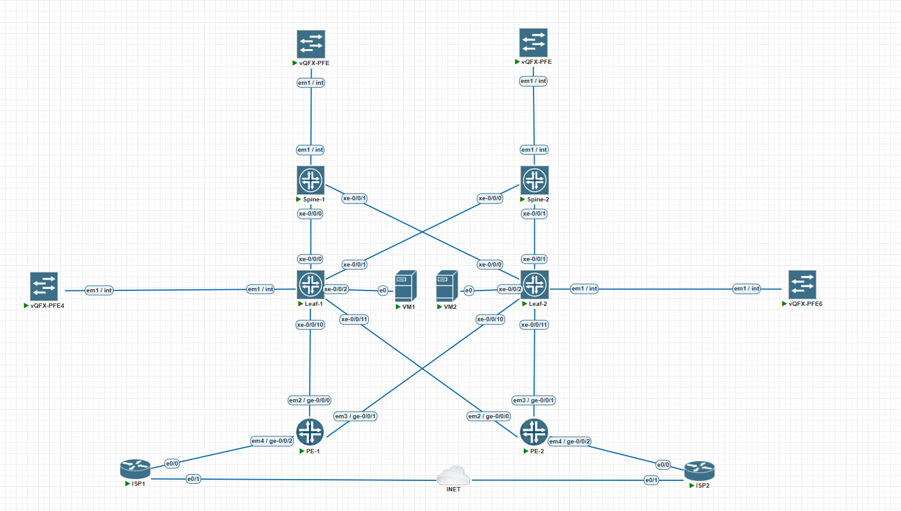

# VxLAN. Аналоги VPC
---

В данной лабе рассмотрим подключения с ESI multihoming, подключим PE маршрутизаторы к нашим LEAF с помощью LACP, сэмулируем подключения к ISP и выпустим VM в интернет через ISP.

В качестве PE - Juniper vMX.\
В качестве ISP - Cisco IOL.

## Схема:


## Адресация:

Для эмуляции белого адресного пространства, везде будут использованы сети из диапазона 100.64.0.0/10.
| Сеть               | Назначение                 | Устройство | IP-адрес |
|--------------------|----------------------------|------------|----------|
| 100.64.10.0/24     | Сеть VM1 (vlan 100)        | VM1        | .200     |
|                    |                            | LEAF-1     | .1       |
| 100.64.20.0/24     | Сеть VM2 (vlan 200)        | VM2        | .200     |
|                    |                            | LEAF-2     | .1       |
| 100.100.100.0/24   | LEAF ↔ PE1 (vlan 1000)     | PE1        | .1       |
|                    |                            | LEAF-1     | .2       |
|                    |                            | LEAF-2     | .3       |
| 100.100.200.0/24   | LEAF ↔ PE2 (vlan 2000)     | PE2        | .1       |
|                    |                            | LEAF-1     | .2       |
|                    |                            | LEAF-2     | .3       |
| 100.111.100.0/24   | PE1 ↔ ISP1                 | ISP1       | .1       |
|                    |                            | PE1        | .2       |
| 100.112.200.0/24   | PE2 ↔ ISP2                 | ISP2       | .1       |
|                    |                            | PE2        | .2       |

## Конфигурация:

Подготовим роутеры ISP, адрес на uplink они получают по dhcp, нам требуется настроить даунлинк, nat и маршрутизацию во внутренние сети:
### ISP-1
```
ip nat inside source list 100 interface Ethernet0/1 overload
interface Ethernet0/1
 ip address dhcp
 ip nat outside
interface Ethernet0/0
 description PE-1
 ip address 100.111.100.1 255.255.255.0
 ip nat inside
ip route 100.64.0.0 255.192.0.0 100.111.100.2
```
### ISP-2
```
ip nat inside source list 100 interface Ethernet0/1 overload
interface Ethernet0/1
 ip address dhcp
 ip nat outside
interface Ethernet0/0
 description PE-2
 ip address 100.112.200.1 255.255.255.0
 ip nat inside
ip route 100.64.0.0 255.192.0.0 100.112.200.2
```

Настроим PE маршрутизаторы. Настроим стык с ISP, статический default, подготовим агрегированный интерфейс в сторону лифов, и преднастроим bgp для экспорта дефолта и импорта внутренних сетей:
### PE-1/2

Пример приводится для PE-1, на PE-2 конфиг идентичный, за исключением адресации и AS.
```
chassis {
    aggregated-devices {
        ethernet {
            device-count 100;           
        }
    }
}
///Эта команда требуется для возможности использхования агрегатов на JunOS
interfaces {
    ge-0/0/0 {
        description LEAF-1;
        gigether-options {
            802.3ad ae0;
        }
    }
    ge-0/0/1 {
        description LEAF-2;
        gigether-options {
            802.3ad ae0;
        }
    }
    ge-0/0/2 {
        description ISP;
        unit 0 {
            family inet {
                address 100.111.100.2/24;
            }
        }                               
    }
    ae0 {
        description LEAF;
        aggregated-ether-options {
            lacp {
                active;
            }
        }
        unit 0 {
            family inet {
                address 100.100.100.1/24;
            }
        }
    }
}
routing-options {
    static {
        route 0.0.0.0/0 next-hop 100.111.100.1;
    }
    autonomous-system 65100;
}
protocols {
    bgp {                               
        group LEAF {
            type external;
            family inet {
                unicast;
            }
            export DEFAULT;
            multipath multiple-as;
            neighbor 100.100.100.2 {
                description LEAF-1;
                peer-as 65001;
            }
            neighbor 100.100.100.3 {
                description LEAF-2;
                peer-as 65002;
            }
        }
    }
}
///Испотзовать будем eBGP
policy-options {
    policy-statement DEFAULT {
        term DEFAUL {
            from {                      
                protocol static;
                route-filter 0.0.0.0/0 exact;
            }
            then accept;
        }
        then reject;
    }
}
///Экспортируется только default route, на импорт политика не требуется, по умолчанию принимается все.
```
Приступаем к настройке на LEAF коммутаторах.
### LEAF:

В прошлых занятиях мы настраивали сети для VM, они сменятся согласно новому адресному плану, процедуру смены адресации, думаю, можно опустить.\
Пример приводится для LEAF-1, на LEAF-2 конфигурации подобная, заисключением адресов и AS.\
Настроим vlan и irb которые будут использоваться для стыков с PE, включим поддержку агрегированных каналов:
```
chassis {                               
    aggregated-devices {
        ethernet {
            device-count 100;
        }
    }
}
vlans {
    v1000 {
        description PE-1;
        vlan-id 1000;
        l3-interface irb.1000;
        vxlan {
            vni 1000;
        }
    }
    v2000 {
        description PE-2;
        vlan-id 2000;
        l3-interface irb.2000;
        vxlan {
            vni 2000;
        }
    }
}
interfaces {
    irb {
        unit 1000 {
            family inet {
                address 100.100.100.2/24;
            }
        }
        unit 2000 {
            family inet {
                address 100.100.200.2/24;
            }
        }
    }
}
routing-instances {
    WAN {
        interface irb.1000;
        interface irb.2000;
```
Настроим ESI интерфейсы и соберем физ интерфейсы в агрегат:
```
interfaces {
    xe-0/0/10 {
        description PE-1;
        ether-options {
            802.3ad ae0;
        }
    }
    xe-0/0/11 {
        description PE-2;
        ether-options {
            802.3ad ae1;                
        }
    }
    ae0 {
        description PE-1;
        esi {
            00:01:01:01:01:01:01:01:01:00;
            all-active;
        }
        aggregated-ether-options {
            lacp {
                active;
                system-id 00:01:01:01:01:00;
            }
        }
        unit 0 {
            family ethernet-switching {
                vlan {
                    members v1000;
                }
            }
        }
    }
    ae1 {                               
        description PE-2;
        esi {
            00:01:01:01:01:01:01:01:01:01;
            all-active;
        }
        aggregated-ether-options {
            lacp {
                active;
                system-id 00:01:01:01:01:01;
            }
        }
        unit 0 {
            family ethernet-switching {
                vlan {
                    members v2000;
                }
            }
        }
    }
}
```
esi - уникальное значение для каждого lag во всей фабрике, одинаковое на коммутаторах учавствующих в текущей агрегации.\
system-id - **На сколько я понял, это значение может быть одинаковым на коробке в разных esi, хотелось бы получить коментарий тут**, одинаковое на коммутаторах учавствующих в текущей агрегации.

Посмотрим поднялись ли интерфейсы и появились ли type 1/4 маршруты:
```
root@LEAF-1> show interfaces descriptions 
Interface       Admin Link Description
xe-0/0/0        up    up   SPINE-1
xe-0/0/1        up    up   SPINE-2
xe-0/0/2        up    up   HOST-1
xe-0/0/10       up    up   PE-1
xe-0/0/11       up    up   PE-2
ae0             up    up   PE-1
ae1             up    up   PE-2

root@LEAF-1> show route
***
default-switch.evpn.0: 31 destinations, 44 routes (31 active, 0 holddown, 0 hidden)
+ = Active Route, - = Last Active, * = Both

1:10.200.0.3:1::010101010101010100::0/192 AD/EVI        
                   *[EVPN/170] 01:53:56
                      Indirect
1:10.200.0.3:1::010101010101010101::0/192 AD/EVI        
                   *[EVPN/170] 01:53:56
                      Indirect
1:10.200.0.4:0::010101010101010100::FFFF:FFFF/192 AD/ESI        
                   *[BGP/170] 02:57:25, localpref 100, from 10.200.0.1
                      AS path: I, validation-state: unverified
                      to 10.100.0.0 via xe-0/0/0.0
                    > to 10.100.0.4 via xe-0/0/1.0
                    [BGP/170] 02:57:25, localpref 100, from 10.200.0.2
                      AS path: I, validation-state: unverified
                      to 10.100.0.0 via xe-0/0/0.0
                    > to 10.100.0.4 via xe-0/0/1.0
1:10.200.0.4:0::010101010101010101::FFFF:FFFF/192 AD/ESI        
                   *[BGP/170] 02:57:25, localpref 100, from 10.200.0.1
                      AS path: I, validation-state: unverified
                      to 10.100.0.0 via xe-0/0/0.0
                    > to 10.100.0.4 via xe-0/0/1.0
                    [BGP/170] 02:57:25, localpref 100, from 10.200.0.2
                      AS path: I, validation-state: unverified
                      to 10.100.0.0 via xe-0/0/0.0
                    > to 10.100.0.4 via xe-0/0/1.0
1:10.200.0.4:1::010101010101010100::0/192 AD/EVI        
                   *[BGP/170] 02:57:25, localpref 100, from 10.200.0.1
                      AS path: I, validation-state: unverified
                      to 10.100.0.0 via xe-0/0/0.0
                    > to 10.100.0.4 via xe-0/0/1.0
                    [BGP/170] 02:57:25, localpref 100, from 10.200.0.2
                      AS path: I, validation-state: unverified
                      to 10.100.0.0 via xe-0/0/0.0
                    > to 10.100.0.4 via xe-0/0/1.0
1:10.200.0.4:1::010101010101010101::0/192 AD/EVI        
                   *[BGP/170] 02:57:25, localpref 100, from 10.200.0.1
                      AS path: I, validation-state: unverified
                      to 10.100.0.0 via xe-0/0/0.0
                    > to 10.100.0.4 via xe-0/0/1.0
                    [BGP/170] 02:57:25, localpref 100, from 10.200.0.2
                      AS path: I, validation-state: unverified
                      to 10.100.0.0 via xe-0/0/0.0
                    > to 10.100.0.4 via xe-0/0/1.0
2:10.200.0.3:1::100::00:00:5e:00:53:01/304 MAC/IP        
                   *[EVPN/170] 01:54:30
                      Indirect
2:10.200.0.3:1::100::50:9d:51:00:09:00/304 MAC/IP        
                   *[EVPN/170] 1d 16:26:22
                      Indirect
2:10.200.0.3:1::100::50:c0:14:00:09:00/304 MAC/IP        
                   *[EVPN/170] 1d 16:15:43
                      Indirect
2:10.200.0.3:1::1000::00:05:86:71:a6:c0/304 MAC/IP        
                   *[EVPN/170] 01:53:49
                      Indirect
2:10.200.0.3:1::1000::02:05:86:71:dc:00/304 MAC/IP        
                   *[EVPN/170] 01:54:30
                      Indirect
2:10.200.0.3:1::2000::00:05:86:71:57:c0/304 MAC/IP        
                   *[EVPN/170] 01:35:52
                      Indirect
2:10.200.0.3:1::2000::02:05:86:71:dc:00/304 MAC/IP        
                   *[EVPN/170] 01:54:30 
                      Indirect
2:10.200.0.4:1::1000::00:05:86:71:a6:c0/304 MAC/IP        
                   *[BGP/170] 02:41:47, localpref 100, from 10.200.0.1
                      AS path: I, validation-state: unverified
                      to 10.100.0.0 via xe-0/0/0.0
                    > to 10.100.0.4 via xe-0/0/1.0
                    [BGP/170] 02:41:47, localpref 100, from 10.200.0.2
                      AS path: I, validation-state: unverified
                      to 10.100.0.0 via xe-0/0/0.0
                    > to 10.100.0.4 via xe-0/0/1.0
2:10.200.0.4:1::1000::02:05:86:71:bd:00/304 MAC/IP        
                   *[BGP/170] 01:54:20, localpref 100, from 10.200.0.1
                      AS path: I, validation-state: unverified
                    > to 10.100.0.0 via xe-0/0/0.0
                      to 10.100.0.4 via xe-0/0/1.0
                    [BGP/170] 01:54:20, localpref 100, from 10.200.0.2
                      AS path: I, validation-state: unverified
                    > to 10.100.0.0 via xe-0/0/0.0
                      to 10.100.0.4 via xe-0/0/1.0
2:10.200.0.4:1::2000::00:05:86:71:57:c0/304 MAC/IP        
                   *[BGP/170] 02:21:49, localpref 100, from 10.200.0.1
                      AS path: I, validation-state: unverified
                    > to 10.100.0.0 via xe-0/0/0.0
                      to 10.100.0.4 via xe-0/0/1.0
                    [BGP/170] 02:21:49, localpref 100, from 10.200.0.2
                      AS path: I, validation-state: unverified
                    > to 10.100.0.0 via xe-0/0/0.0
                      to 10.100.0.4 via xe-0/0/1.0
2:10.200.0.4:1::2000::02:05:86:71:bd:00/304 MAC/IP        
                   *[BGP/170] 01:54:20, localpref 100, from 10.200.0.1
                      AS path: I, validation-state: unverified
                      to 10.100.0.0 via xe-0/0/0.0
                    > to 10.100.0.4 via xe-0/0/1.0
                    [BGP/170] 01:54:20, localpref 100, from 10.200.0.2
                      AS path: I, validation-state: unverified
                      to 10.100.0.0 via xe-0/0/0.0
                    > to 10.100.0.4 via xe-0/0/1.0
2:10.200.0.3:1::100::00:00:5e:00:53:01::100.64.10.1/304 MAC/IP        
                   *[EVPN/170] 01:54:30
                      Indirect
2:10.200.0.3:1::100::50:c0:14:00:09:00::100.64.10.200/304 MAC/IP        
                   *[EVPN/170] 03:09:32
                      Indirect
2:10.200.0.3:1::1000::00:05:86:71:a6:c0::100.100.100.1/304 MAC/IP        
                   *[EVPN/170] 01:47:19
                      Indirect          
2:10.200.0.3:1::1000::02:05:86:71:dc:00::100.100.100.2/304 MAC/IP        
                   *[EVPN/170] 01:54:30
                      Indirect
2:10.200.0.3:1::2000::00:05:86:71:57:c0::100.100.200.1/304 MAC/IP        
                   *[EVPN/170] 00:05:52
                      Indirect
2:10.200.0.3:1::2000::02:05:86:71:dc:00::100.100.200.2/304 MAC/IP        
                   *[EVPN/170] 01:54:30
                      Indirect
2:10.200.0.4:1::1000::02:05:86:71:bd:00::100.100.100.3/304 MAC/IP        
                   *[BGP/170] 01:54:20, localpref 100, from 10.200.0.1
                      AS path: I, validation-state: unverified
                    > to 10.100.0.0 via xe-0/0/0.0
                      to 10.100.0.4 via xe-0/0/1.0
                    [BGP/170] 01:54:20, localpref 100, from 10.200.0.2
                      AS path: I, validation-state: unverified
                    > to 10.100.0.0 via xe-0/0/0.0
                      to 10.100.0.4 via xe-0/0/1.0
2:10.200.0.4:1::2000::00:05:86:71:57:c0::100.100.200.1/304 MAC/IP        
                   *[BGP/170] 02:18:16, localpref 100, from 10.200.0.1
                      AS path: I, validation-state: unverified
                      to 10.100.0.0 via xe-0/0/0.0
                    > to 10.100.0.4 via xe-0/0/1.0
                    [BGP/170] 02:18:16, localpref 100, from 10.200.0.2
                      AS path: I, validation-state: unverified
                      to 10.100.0.0 via xe-0/0/0.0
                    > to 10.100.0.4 via xe-0/0/1.0
2:10.200.0.4:1::2000::02:05:86:71:bd:00::100.100.200.3/304 MAC/IP        
                   *[BGP/170] 01:54:20, localpref 100, from 10.200.0.1
                      AS path: I, validation-state: unverified
                    > to 10.100.0.0 via xe-0/0/0.0
                      to 10.100.0.4 via xe-0/0/1.0
                    [BGP/170] 01:54:20, localpref 100, from 10.200.0.2
                      AS path: I, validation-state: unverified
                    > to 10.100.0.0 via xe-0/0/0.0
                      to 10.100.0.4 via xe-0/0/1.0
3:10.200.0.3:1::100::10.200.0.3/248 IM            
                   *[EVPN/170] 1d 16:26:41
                      Indirect
3:10.200.0.3:1::1000::10.200.0.3/248 IM            
                   *[EVPN/170] 03:49:50
                      Indirect
3:10.200.0.3:1::2000::10.200.0.3/248 IM            
                   *[EVPN/170] 03:49:50
                      Indirect
3:10.200.0.4:1::1000::10.200.0.4/248 IM            
                   *[BGP/170] 02:57:25, localpref 100, from 10.200.0.1
                      AS path: I, validation-state: unverified
                      to 10.100.0.0 via xe-0/0/0.0
                    > to 10.100.0.4 via xe-0/0/1.0
                    [BGP/170] 02:57:25, localpref 100, from 10.200.0.2
                      AS path: I, validation-state: unverified
                      to 10.100.0.0 via xe-0/0/0.0
                    > to 10.100.0.4 via xe-0/0/1.0
3:10.200.0.4:1::2000::10.200.0.4/248 IM            
                   *[BGP/170] 02:57:25, localpref 100, from 10.200.0.1
                      AS path: I, validation-state: unverified
                    > to 10.100.0.0 via xe-0/0/0.0
                      to 10.100.0.4 via xe-0/0/1.0
                    [BGP/170] 02:57:25, localpref 100, from 10.200.0.2
                      AS path: I, validation-state: unverified
                    > to 10.100.0.0 via xe-0/0/0.0
                      to 10.100.0.4 via xe-0/0/1.0

__default_evpn__.evpn.0: 6 destinations, 8 routes (6 active, 0 holddown, 0 hidden)
+ = Active Route, - = Last Active, * = Both

1:10.200.0.3:0::010101010101010100::FFFF:FFFF/192 AD/ESI        
                   *[EVPN/170] 01:53:55
                      Indirect
1:10.200.0.3:0::010101010101010101::FFFF:FFFF/192 AD/ESI        
                   *[EVPN/170] 01:53:55
                      Indirect
4:10.200.0.3:0::010101010101010100:10.200.0.3/296 ES            
                   *[EVPN/170] 01:53:56
                      Indirect
4:10.200.0.3:0::010101010101010101:10.200.0.3/296 ES            
                   *[EVPN/170] 01:53:56
                      Indirect
4:10.200.0.4:0::010101010101010100:10.200.0.4/296 ES            
                   *[BGP/170] 02:57:25, localpref 100, from 10.200.0.1
                      AS path: I, validation-state: unverified
                    > to 10.100.0.0 via xe-0/0/0.0
                      to 10.100.0.4 via xe-0/0/1.0
                    [BGP/170] 02:57:25, localpref 100, from 10.200.0.2
                      AS path: I, validation-state: unverified
                    > to 10.100.0.0 via xe-0/0/0.0
                      to 10.100.0.4 via xe-0/0/1.0
4:10.200.0.4:0::010101010101010101:10.200.0.4/296 ES            
                   *[BGP/170] 02:57:25, localpref 100, from 10.200.0.1
                      AS path: I, validation-state: unverified
                    > to 10.100.0.0 via xe-0/0/0.0
                      to 10.100.0.4 via xe-0/0/1.0
                    [BGP/170] 02:57:25, localpref 100, from 10.200.0.2
                      AS path: I, validation-state: unverified
                    > to 10.100.0.0 via xe-0/0/0.0
                      to 10.100.0.4 via xe-0/0/1.0

{master:0}
root@LEAF-1> show route table __default_evpn__.evpn.0 

__default_evpn__.evpn.0: 6 destinations, 8 routes (6 active, 0 holddown, 0 hidden)
+ = Active Route, - = Last Active, * = Both

1:10.200.0.3:0::010101010101010100::FFFF:FFFF/192 AD/ESI        
                   *[EVPN/170] 01:54:12
                      Indirect
1:10.200.0.3:0::010101010101010101::FFFF:FFFF/192 AD/ESI        
                   *[EVPN/170] 01:54:12
                      Indirect
4:10.200.0.3:0::010101010101010100:10.200.0.3/296 ES            
                   *[EVPN/170] 01:54:13
                      Indirect
4:10.200.0.3:0::010101010101010101:10.200.0.3/296 ES            
                   *[EVPN/170] 01:54:13
                      Indirect
4:10.200.0.4:0::010101010101010100:10.200.0.4/296 ES            
                   *[BGP/170] 02:57:42, localpref 100, from 10.200.0.1
                      AS path: I, validation-state: unverified
                    > to 10.100.0.0 via xe-0/0/0.0
                      to 10.100.0.4 via xe-0/0/1.0
                    [BGP/170] 02:57:42, localpref 100, from 10.200.0.2
                      AS path: I, validation-state: unverified
                    > to 10.100.0.0 via xe-0/0/0.0
                      to 10.100.0.4 via xe-0/0/1.0
4:10.200.0.4:0::010101010101010101:10.200.0.4/296 ES            
                   *[BGP/170] 02:57:42, localpref 100, from 10.200.0.1
                      AS path: I, validation-state: unverified
                    > to 10.100.0.0 via xe-0/0/0.0
                      to 10.100.0.4 via xe-0/0/1.0
                    [BGP/170] 02:57:42, localpref 100, from 10.200.0.2
                      AS path: I, validation-state: unverified
                    > to 10.100.0.0 via xe-0/0/0.0
                      to 10.100.0.4 via xe-0/0/1.0

{master:0}

```
Как мы видим, все необоходимые маршруты имеются, lacp собрался, посмотрим кто стал DF:
```
root@LEAF-1> show evpn instance designated-forwarder 
Instance: default-switch
  Number of ethernet segments: 5
    ESI: 00:01:01:01:01:01:01:01:01:00
      Designated forwarder: 10.200.0.3
    ESI: 00:01:01:01:01:01:01:01:01:01
      Designated forwarder: 10.200.0.3
    ESI: 05:00:00:fd:e8:00:00:00:64:00
    ESI: 05:00:00:fd:e8:00:00:03:e8:00
    ESI: 05:00:00:fd:e8:00:00:07:d0:00

{master:0}
```
Для обоих ESI DF стал LEAF-1.

Настроим bgp c PE:
```
routing-instances {
    WAN {
        protocols {                     
            bgp {
                group PE {
                    type external;
                    family inet {
                        unicast;
                    }
                    export LOCAL;
                    local-as 65001;
                    multipath {
                        multiple-as;
                    }
                    neighbor 100.100.100.1 {
                        description PE-1;
                        peer-as 65100;
                    }
                    neighbor 100.100.200.1 {
                        description PE-2;
                        peer-as 65200;
                    }
                }
            }
        }
    }
}
```

Посмотрим статус пиров со стороны PE-1:
```
root@PE-1> show bgp summary 
Groups: 1 Peers: 2 Down peers: 1
Table          Tot Paths  Act Paths Suppressed    History Damp State    Pending
inet.0               
                       4          3          0          0          0          0
Peer                     AS      InPkt     OutPkt    OutQ   Flaps Last Up/Dwn State|#Active/Received/Accepted/Damped...
100.100.100.2         65001          3          4       0       0          19 3/4/4/0              0/0/0/0
100.100.100.3         65002          0          0       0       0          31 Connect
```
Как видим, bgp поднялся только с LEAF-1, заглянем в логи:
```
PE-1 rpd[2341]: bgp_read_v4_message:10756: NOTIFICATION received from 100.100.100.2 (External AS 65001): code 4 (Hold Timer Expired Error), socket buffer sndcc: 57 rcvcc: 0 TCP state: 5, snd_una: 3892312450 snd_nxt: 3892312507 snd_wnd: 16384 rcv_nxt: 3260594691 rcv_adv: 3260611579, hold timer out 90s, hold timer remain 43.647005s
```
Это можно объяснить тем, что трафик предназначающийся одному лифу, может передаваться через другой из-за балансировки lacp, и трафик передается через evpn. bgp по умолчанию отправляет пакеты с TTL=1, что не позволяет установить сессию из-за наличия хопов в evpn. Включим мультихоп везде:

Leaf:
```
set routing-instances WAN protocols bgp group PE multihop
```
PE:
```
set protocols bgp group LEAF multihop
```

После применения этой конфигурации у меня ничего не изменилось, я добавил команду на leaf коммутаторах - set protocols evpn default-gateway no-gateway-community, эта команда отключает добавление evpn default-gateway, что позволяет коммутаторам ипортировать маршруты с других лифов, даже если у них такойже mac/ip как у локального интерфейса. Я не понял как это могло помочь, не ломает ли эта команда другую логику работы, мешает ли наличие или отсутствие этой команды агрегату, но после ее применения поднялись все сессии. После завершения лабы я игрался с этим параметром, включал-отключал, что приводило к совершенно разным последствием, то перестовали пенгаться лифы с пешек, то переставал пенгаться один лиф, то все хорошо, несколько раз у меня крашились джуны, но в конечном итоге все заработало и без наличия этой команды. Возможно это просто проблемы виртуальной среды. Так же хотел получить комментарии по этому поводу, и в целом о топологии, стоит ли так подключать роутеры и строить маршрутизацию, или есть какойто другой бест практис?


Проверяем соседства:
```
root@PE-1> show bgp summary      
Groups: 1 Peers: 2 Down peers: 0
Table          Tot Paths  Act Paths Suppressed    History Damp State    Pending
inet.0               
                       8          4          0          0          0          0
Peer                     AS      InPkt     OutPkt    OutQ   Flaps Last Up/Dwn State|#Active/Received/Accepted/Damped...
100.100.100.2         65001         56         58       0       1       24:27 2/4/4/0              0/0/0/0
100.100.100.3         65002          4          3       0       1           2 2/4/4/0              0/0/0/0

```

Соседства поднялись, по каунтерам мы видим что маршруты появились, проверим доступ в интернет с VM:
```
gns3@box:~$ ip a
1: lo: <LOOPBACK,UP,LOWER_UP> mtu 65536 qdisc noqueue state UNKNOWN 
    link/loopback 00:00:00:00:00:00 brd 00:00:00:00:00:00
    inet 127.0.0.1/8 scope host lo
       valid_lft forever preferred_lft forever
    inet6 ::1/128 scope host 
       valid_lft forever preferred_lft forever
2: dummy0: <BROADCAST,NOARP> mtu 1500 qdisc noop state DOWN 
    link/ether 16:0d:09:73:c2:a8 brd ff:ff:ff:ff:ff:ff
3: tunl0@NONE: <NOARP> mtu 1480 qdisc noop state DOWN 
    link/ipip 0.0.0.0 brd 0.0.0.0
4: ip_vti0@NONE: <NOARP> mtu 1364 qdisc noop state DOWN 
    link/ipip 0.0.0.0 brd 0.0.0.0
5: eth0: <BROADCAST,MULTICAST,UP,LOWER_UP> mtu 1500 qdisc pfifo_fast state UP qlen 1000
    link/ether 50:cf:4c:00:09:00 brd ff:ff:ff:ff:ff:ff
    inet 100.64.10.200/24 brd 100.64.10.255 scope global eth0
       valid_lft forever preferred_lft forever
    inet6 fe80::52cf:4cff:fe00:900/64 scope link 
       valid_lft forever preferred_lft forever
gns3@box:~$ ping 8.8.8.8
PING 8.8.8.8 (8.8.8.8): 56 data bytes
64 bytes from 8.8.8.8: seq=0 ttl=102 time=124.522 ms
64 bytes from 8.8.8.8: seq=1 ttl=102 time=183.804 ms
64 bytes from 8.8.8.8: seq=2 ttl=102 time=200.230 ms
64 bytes from 8.8.8.8: seq=3 ttl=102 time=141.563 ms
64 bytes from 8.8.8.8: seq=4 ttl=102 time=119.853 ms
64 bytes from 8.8.8.8: seq=5 ttl=102 time=132.103 ms
^C
--- 8.8.8.8 ping statistics ---
6 packets transmitted, 6 packets received, 0% packet loss
round-trip min/avg/max = 119.853/150.345/200.230 ms
```

Доступ в интернет есть, все работает.

Убедимся что рабоает мультипас:
```
WAN.inet.0: 11 destinations, 15 routes (11 active, 0 holddown, 0 hidden)
@ = Routing Use Only, # = Forwarding Use Only
+ = Active Route, - = Last Active, * = Both

0.0.0.0/0          *[BGP/170] 00:40:24, localpref 100, from 100.100.200.1
                      AS path: 65200 I, validation-state: unverified
                    > to 100.100.100.1 via irb.1000
                      to 100.100.200.1 via irb.2000
                    [BGP/170] 00:40:24, localpref 100
                      AS path: 65100 I, validation-state: unverified
                    > to 100.100.100.1 via irb.1000
                    [EVPN/170] 00:15:59
                    > to 10.100.0.0 via xe-0/0/0.0
                      to 10.100.0.4 via xe-0/0/1.0
```
Как мы видим, все работает.

Файлы конфигурации(с использованием type 5 маршрутов):
- [LEAF-1](LEAF-1)
- [LEAF-2](LEAF-2)
- [PE-1](PE-1)
- [PE-2](PE-2)
