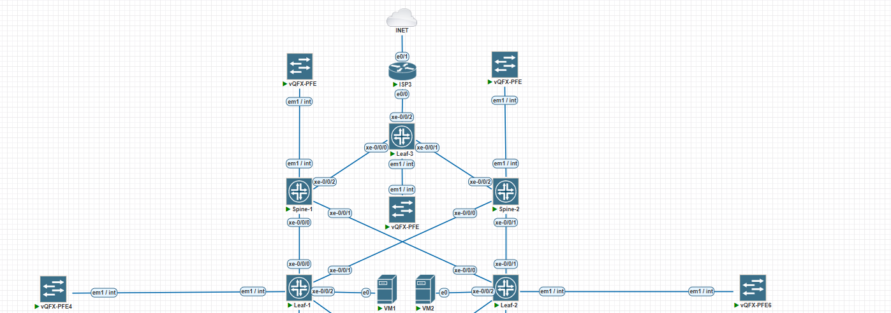

# Оптимизация таблиц маршрутизации

В данной работе поместим VM каждую в свой VRF и настроим маршрутизацию между ними через внешний маршрутизатор.\
Чтобы не ломать прошлые наработки добавим еще один LEAF и ISP.

## Схема:

