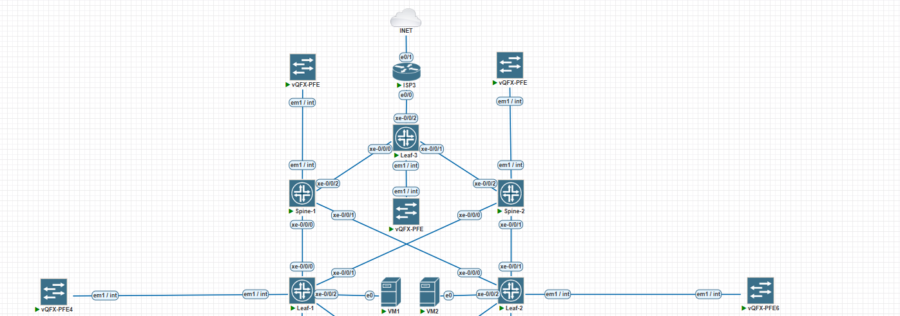

# Оптимизация таблиц маршрутизации

В данной работе поместим VM каждую в свой VRF и настроим маршрутизацию между ними через внешний маршрутизатор.\
Чтобы не ломать прошлые наработки добавим еще один LEAF и ISP.

## Схема:


Не стану расписывать подключение к SPINE для LEAF-3, возьму следующие подсети из адресного плана первой лабы, отмечу только что адрес для vtep будет 10.200.0.5.\
Адресацию для стыков будем использовать следующую:
|VRF|LEAF-3|ISP-3|
|-----|------|-----|
|1|100.100.1.2/24|100.100.1.1/24|
|2|100.100.2.2/24|100.100.2.1/24|

## Кофигурация:

Выполним базовую конфигурацию ISP для выхода в интернет и маршрутизации между VRF, использовать будем статику и саб интерфейсы:

### ISP-3:
```
interface Ethernet0/0
 no ip address

interface Ethernet0/0.300
 description VRF-1
 encapsulation dot1Q 300
 ip address 100.100.1.1 255.255.255.0
 ip nat inside
 ip virtual-reassembly in

interface Ethernet0/0.400
 description VRF-2
 encapsulation dot1Q 400
 ip address 100.100.2.1 255.255.255.0
 ip nat inside
 ip virtual-reassembly in

interface Ethernet0/1
 ip address dhcp
 ip nat outside

ip route 100.64.10.0 255.255.255.0 100.100.1.2
ip route 100.64.20.0 255.255.255.0 100.100.2.2

access-list 100 permit ip any any

ip nat inside source list 100 interface ethernet 0/1 overload

```

Создадим VRF на LEAF-1 и LEAF-2 и переместим в них соответствующие irb интерфейсы из WAN vrf:

### Leaf-1:
```
routing-instances {
    VRF-1 {
        instance-type vrf;
        interface irb.100;
        route-distinguisher 10.200.0.3:101;
        vrf-target target:65002:1;
        vrf-table-label;
        routing-options {
            multipath {
                vpn-unequal-cost equal-external-internal;
            }
            auto-export;
        }
        protocols {
            evpn {
                ip-prefix-routes {      
                    advertise direct-nexthop;
                    encapsulation vxlan;
                    vni 65002;
                }
            }
        }
    }
```

### Leaf-2:
```
routing-instances {
    VRF-2 {
        instance-type vrf;
        interface irb.200;
        route-distinguisher 10.200.0.4:102;
        vrf-target target:65003:1;
        vrf-table-label;
        routing-options {
            multipath {
                vpn-unequal-cost equal-external-internal;
            }
            auto-export;
        }
        protocols {
            evpn {
                ip-prefix-routes {      
                    advertise direct-nexthop;
                    encapsulation vxlan;
                    vni 65003;
                }
            }
        }
    }
```

Создадим на Leaf-3 оба VRF и пропишем статические default маршруты в каждой VRF:

### Leaf-3:
```
routing-instances {
    VRF-1 {
        routing-options {
            static {
                route 0.0.0.0/0 next-hop 100.100.1.1;
            }
            multipath {
                vpn-unequal-cost equal-external-internal;
            }
            auto-export;
        }
        protocols {
            evpn {
                ip-prefix-routes {
                    advertise direct-nexthop;
                    encapsulation vxlan;
                    vni 65002;
                }
            }
        }
        instance-type vrf;
        interface xe-0/0/2.300;
        route-distinguisher 10.200.0.5:101;
        vrf-target target:65002:1;
        vrf-table-label;
    }
    VRF-2 {
        routing-options {
            static {
                route 0.0.0.0/0 next-hop 100.100.2.1;
            }
            multipath {
                vpn-unequal-cost equal-external-internal;
            }
            auto-export;
        }
        protocols {
            evpn {
                ip-prefix-routes {      
                    advertise direct-nexthop;
                    encapsulation vxlan;
                    vni 65003;
                }
            }
        }
        instance-type vrf;
        interface xe-0/0/2.400;
        route-distinguisher 10.200.0.5:102;
        vrf-target target:65003:1;
        vrf-table-label;
    }
}
```

l2 vni мы при этом не создаем, будем использовать только type 5 маршруты.

Проверяем таблицу маршрутизации на Leaf-1:
```
root@LEAF-1> show route
***
VRF-1.inet.0: 5 destinations, 5 routes (5 active, 0 holddown, 0 hidden)
@ = Routing Use Only, # = Forwarding Use Only
+ = Active Route, - = Last Active, * = Both

0.0.0.0/0          *[EVPN/170] 00:42:08 
                    > to 10.100.0.0 via xe-0/0/0.0
                      to 10.100.0.4 via xe-0/0/1.0
100.64.10.0/24     *[Direct/0] 00:42:08
                    > via irb.100
100.64.10.1/32     *[Local/0] 00:42:08
                      Local via irb.100
100.64.10.200/32   *[EVPN/7] 00:42:04
                    > via irb.100
100.100.1.0/24     *[EVPN/170] 00:42:08
                    > to 10.100.0.0 via xe-0/0/0.0
                      to 10.100.0.4 via xe-0/0/1.0

VRF-1.evpn.0: 3 destinations, 5 routes (3 active, 0 holddown, 0 hidden)
+ = Active Route, - = Last Active, * = Both

5:10.200.0.3:101::0::100.64.10.0::24/248               
                   *[EVPN/170] 00:42:08
                      Indirect
5:10.200.0.5:101::0::0.0.0.0::0/248               
                   *[BGP/170] 00:42:08, localpref 100, from 10.200.0.1
                      AS path: I, validation-state: unverified
                    > to 10.100.0.0 via xe-0/0/0.0
                      to 10.100.0.4 via xe-0/0/1.0
                    [BGP/170] 00:42:07, localpref 100, from 10.200.0.2
                      AS path: I, validation-state: unverified
                    > to 10.100.0.0 via xe-0/0/0.0
                      to 10.100.0.4 via xe-0/0/1.0
5:10.200.0.5:101::0::100.100.1.0::24/248               
                   *[BGP/170] 00:42:08, localpref 100, from 10.200.0.1
                      AS path: I, validation-state: unverified
                      to 10.100.0.0 via xe-0/0/0.0
                    > to 10.100.0.4 via xe-0/0/1.0
                    [BGP/170] 00:42:07, localpref 100, from 10.200.0.2
                      AS path: I, validation-state: unverified
                      to 10.100.0.0 via xe-0/0/0.0
                    > to 10.100.0.4 via xe-0/0/1.0
```

Как видим, маршруты имеются. На Leaf-2 ситуация аналогична для своей VRF. Проверим свзность VM-1 с внешним миром и VM-2.

```
gns3@box:~$ ping 8.8.8.8
PING 8.8.8.8 (8.8.8.8): 56 data bytes
64 bytes from 8.8.8.8: seq=0 ttl=102 time=506.276 ms
64 bytes from 8.8.8.8: seq=1 ttl=102 time=322.097 ms
64 bytes from 8.8.8.8: seq=2 ttl=102 time=355.905 ms
^C
--- 8.8.8.8 ping statistics ---
3 packets transmitted, 3 packets received, 0% packet loss
round-trip min/avg/max = 322.097/394.759/506.276 ms
gns3@box:~$ ping 100.64.20.200
PING 100.64.20.200 (100.64.20.200): 56 data bytes
64 bytes from 100.64.20.200: seq=0 ttl=60 time=785.602 ms
64 bytes from 100.64.20.200: seq=1 ttl=60 time=891.008 ms
64 bytes from 100.64.20.200: seq=2 ttl=60 time=702.830 ms
^C
--- 100.64.20.200 ping statistics ---
4 packets transmitted, 3 packets received, 25% packet loss
round-trip min/avg/max = 702.830/793.146/891.008 ms
```

Как видим связность есть, все работает, и на этом стоило бы завершить, НО, попробуем пингануть с VM-1 шлюз расположенный на Leaf-2:
```
gns3@box:~$ ping 100.64.20.1
PING 100.64.20.1 (100.64.20.1): 56 data bytes
^C
--- 100.64.20.1 ping statistics ---
3 packets transmitted, 0 packets received, 100% packet loss
```

Связности нет, что-то не так, подумал я, убил кучу времени на исследование, и выяснил следующее:\
В виртуальной инфраструктуре используется JunOS 18.x, и этой версии для корректной работы EVPN необходимы как маршруты type 5, так и маршруты type 2. Без Type 2 control-plane не формирует полные ARP-записи, и, несмотря на наличие маршрута в data-plane, удалённый leaf не может вернуть ответ, так как не знает MAC-адрес назначения. Forwarding при этом работает корректно.\
Тоесть чтобы заработала связность между VM-1 и Leaf-2, нам нужно создать оба l2 vni c l3 интерфейсами и anycast gw.\
А вот например в версии JunOS 22.x это пофикшено, и достаточно иметь irb интерфейс только на том Leaf коммутаторе, где он действительно необходим.

Так же я попробовал остаить irb интерфейсы только на Leaf-3, а на Leaf-1|2 сделать просто l2 vlan. Это привело к тому что type 2 маршрут адреса VM распространялся без ip адреса, в дампе BGP Update можно было увидеть для маршрута IP Address = NOT INCLUDED. И в evpn database не будет связки mac+ip, это так же связано с отсутствием l3 интерфейса. В 22 версии, эта связка имеется, но при таком сценарии все равно нет связности между VM и шлюзом в этой версии, если он на удаленном vtep. Как я понял, в данном сценарии локальный leaf не может связать трафик между 2 и 5 маршрутами и просто дропает трафик, более детального объяснения сформулировать у меня не выходит, но для себя я понял что если используется l3 интерфейс на leaf, то он должен существовать везде, где есть потребители этого vlan.

Файл конфигурации [LEAF-3](LEAF-3)
